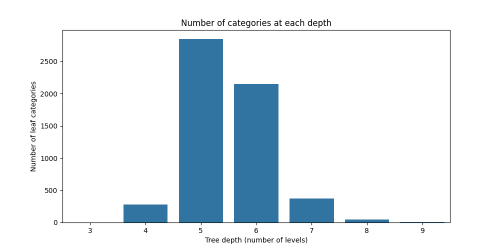

# e-Commerce Categorization
Implementing LIME (Local Interpretable Model-agnostic Explanations) to explain predictions of a Hierarchical FastText classifier in the e-commerce product categorization domain
---
This repository contains the course project **"Explaining Consistent Text Categorization in E-Commerce using LIME"**.

### Team

- **Danis Sharafiev**
- **Mariia Chugaeva**
- **Nikita Shiyanov**

---

## Milestone: Dataset preprocessing & exploratory analysis

### Dataset (AlleNoise)

We work with the **AlleNoise** e-commerce product categorization dataset:

- **Offers table**: product titles with both *clean* and *noisy* category IDs
- **Category mapping**: mapping from category ID to the full hierarchical category path

In this repo, raw files are:

- `data/raw_data/full_dataset.csv`
- `data/raw_data/category_mapping.csv`

Based on the analysis performed in `notebooks/data_preprocessing.ipynb`, we found that:

- `full_dataset.csv`: **502,310 rows**, columns: `offer_id`, `text`, `clean_category_id`, `noisy_category_id`
- `category_mapping.csv`: **5,692 rows**, columns: `category_label`, `category_name`

### What preprocessing does

The preprocessing script builds explicit hierarchy level columns from `category_name` and joins them to each offer for both clean and noisy labels.

Script:

- `src/data/prepare_data.py`

Key steps:

- Split `category_name` by `" > "` into levels `L1`, `L2`, ..., `Lk` (max depth observed in the mapping is **9**)
- Merge hierarchy columns for:
  - `clean_category_id` → `*_clean` columns
  - `noisy_category_id` → `*_noisy` columns
- Save the processed dataset as Parquet for downstream modeling

### Output artifact

Running preprocessing produces:

- `data/prepared_data/processed_dataset.parquet`

### How to run

From the project root:

```bash
python -m src.data.prepare_data
```

This will read the raw CSVs from `data/raw_data/` and write the Parquet file into `data/prepared_data/`.

### Exploratory analysis: taxonomy depth

The figure below shows the distribution of how many leaf categories exist at each hierarchy depth (number of levels in the category path):


