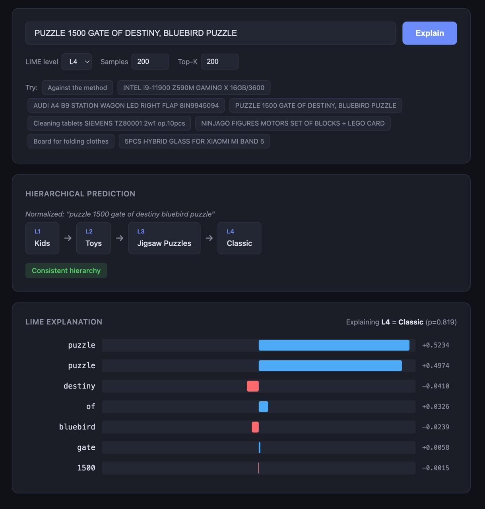
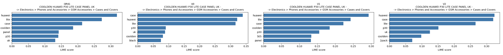
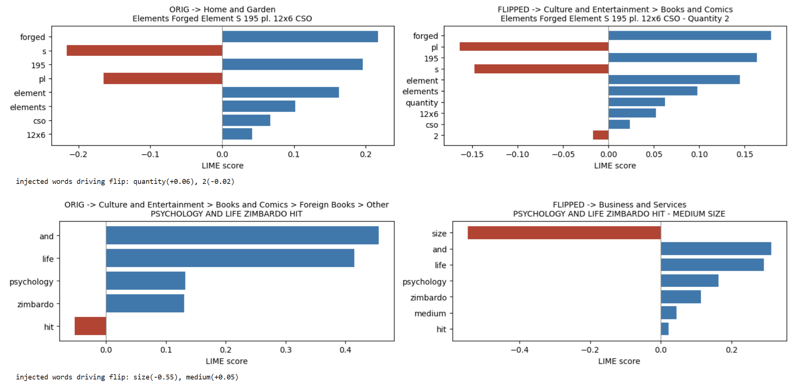

# Explaining Consistent Text Categorization in E-Commerce Using LIME

> **Team:** Danis Sharafiev · Mariia Chugaeva · Nikita Shiyanov

---

## What is this project about?

Online marketplaces list millions of products. Every product needs a category — buyers use it to search, sellers rely on it for visibility, and the platform needs it for recommendations and ads.

We built a **Hierarchical FastText** classifier from scratch (pure NumPy, no external ML frameworks) that categorizes products into a multi-level taxonomy. Then we used **LIME** (Local Interpretable Model-agnostic Explanations) to show *which words* the model looks at when making a decision.

The natural question is: **can we trust these explanations?** To answer that, we:
1. Measured whether they are **faithful** (do they really reflect what the model relies on?).
2. Tested whether they are **consistent** (do they stay the same if we slightly rephrase the product title?).

We also built an **interactive web demo** where you can type any product title and see the prediction + LIME explanation live.

---

## Dataset: AlleNoise

We use the **AlleNoise** dataset from the Allegro marketplace:

| File | Rows | Columns |
|------|------|---------|
| `data/raw_data/full_dataset.csv` | 502,310 | `offer_id`, `text`, `clean_category_id`, `noisy_category_id` |
| `data/raw_data/category_mapping.csv` | 5,692 | `category_label`, `category_name` |

Category paths look like `Allegro > Electronics > Phones > Smartphones`. We split by `" > "` and keep levels L1–L4 (L0 is always "Allegro"). For training we use `clean_category_id` to avoid label noise.

**Top-10 L1 categories** (25k training subset):

| Category | Count |
|----------|------:|
| Automotive | 4,267 |
| Home and Garden | 3,830 |
| Fashion | 2,706 |
| Electronics | 2,462 |
| Culture and Entertainment | 2,351 |
| Kids | 1,527 |
| Business and Services | 948 |
| Supermarket | 500 |
| Sports and Travel | 485 |
| Beauty | 466 |

---

## Text Preprocessing

Before feeding titles to the model we normalize them — lowercase, remove punctuation, collapse whitespace:

```python
def normalize(self, text: str) -> str:
    if not isinstance(text, str) or not text.strip():
        return ""
    text = text.lower()
    text = re.sub(r"[^\w\s]", "", text)
    return re.sub(r"\s+", " ", text).strip()
```

Then we build a vocabulary: count every token, keep those appearing ≥ `min_count` times, and map each to an integer index. Unknown words are dropped at inference.

Optionally, we support Snowball stemming (`stem_type="l1"`) or WordNet lemmatization (`stem_type="l2"`) via NLTK.

---

## Model: FastText from Scratch

Instead of Facebook's fastText library we implement a FastText-style classifier **in pure NumPy**. This gives us full access to internals — which we need for LIME.

### Architecture

```
Input text -> Tokenize -> Word IDs
                            |
                            v 
                    Embedding lookup
                            |
                            v
                    Average pooling -> hidden vector h ∈ ℝ^d
                            |
                            v
                    Linear layer (W·h + b)
                            |
                            v
                        Softmax -> class probabilities
```

The forward pass is very simple:

```python
def _forward(self, word_ids):
    if len(word_ids) == 0:
        hidden = np.zeros(self.embed_dim)
    else:
        hidden = self._embedding[word_ids].mean(axis=0)
    logits = hidden @ self._weights + self._bias
    return hidden, _softmax(logits)
```

Training is per-sample SGD with cross-entropy loss. Gradients flow back into the linear layer and the embeddings.

### Hierarchical FastText (HFT)

A single flat classifier struggles with fine-grained categories (L3 has 639 classes, L4 — 1,853). Our solution: **one FastText model per hierarchy level**.

At inference, predictions are **constrained**:
- Level 1 predicts freely.
- Level *i* > 1 may only predict labels that are valid children of the level *i−1* prediction.
- If the constraint is violated, prediction stops and we record `violation_at`.

```python
def predict(self, text: str) -> dict:
    path = []
    violation_at = None
    for level in range(1, self.max_level + 1):
        if level not in self.models:
            break
        pred = self.models[level].predict([text])[0]
        # check hierarchy constraint
        if level > 1:
            allowed = self.valid_children.get(level, {}).get(path[-1], set())
            if pred not in allowed:
                violation_at = level
                break
        path.append(pred)
    return {"path": path, "violation_at": violation_at}
```

---

## Classification Results

Training on 25,000 samples (80/20 split, seed 42), evaluated on 2,000 test samples:

| Level | Classes | acc@1 | acc@3 | acc@5 |
|-------|--------:|------:|------:|------:|
| L1 | 12 | 0.744 | 0.887 | 0.935 |
| L2 | 83 | 0.590 | 0.710 | 0.756 |
| L3 | 639 | 0.288 | 0.382 | 0.426 |
| L4 | 1,853 | 0.204 | 0.273 | 0.314 |

L1 accuracy of 74% with 12 classes from a pure-NumPy model is solid. Deeper levels are harder, but the hierarchy constraint keeps predictions structurally consistent most of the time.

---

## LIME: How It Works (Step by Step)

LIME (Ribeiro et al., 2016) explains a **single prediction** by approximating the complex model locally with a simple, interpretable one.

### Step 1: Perturbation

Given input words `[w1, w2, ..., wn]`, we create N perturbed copies by randomly masking (removing) words. Each perturbation is a binary mask — 1 means the word is kept, 0 means removed:

```python
def _perturb(self, words):
    n = len(words)
    masks = np.ones((self.num_samples, n), dtype=int)
    for i in range(1, self.num_samples):
        mask = self.rng.integers(0, 2, size=n)
        # make sure at least one word survives
        if mask.sum() == 0:
            mask[self.rng.integers(0, n)] = 1
        masks[i] = mask
    texts = [" ".join(w for w, m in zip(words, row) if m) for row in masks]
    return masks, texts
```

### Step 2: Get Model Predictions

Pass all N perturbed texts through `predict_proba` to get the probability of the target class for each perturbation.

### Step 3: Compute Weights

Perturbations closer to the original should matter more. We compute cosine distance between each mask and the original (all-ones) mask, then apply an exponential kernel:

```
weight_i = exp(-distance_i^2 / σ^2),  where σ = 0.25
```

### Step 4: Weighted Linear Regression

Fit a weighted least-squares regression of masks → probabilities. The coefficients **β_j** are the LIME scores — they tell us **how much each word contributed to the prediction**.

- **Positive β**: the word pushed the model *toward* the class.
- **Negative β**: the word pushed it *away*.

### Visualization

The result is a bar chart showing the most important words:

> *Blue bars = words pushing toward the predicted category, Red bars = words pushing away.*



---

## Faithfulness: Are the Explanations Honest?

An explanation is useless if it doesn't reflect what the model actually relies on. We measure three standard faithfulness metrics:

**Comprehensiveness** — remove the top-k important words and measure probability drop. High = the explanation correctly identified important features.

**Sufficiency** — keep *only* the top-k words and check if the prediction survives. Low value = the top words alone are enough.

**Monotonicity** — correlation between word importance and actual probability drop when each word is individually removed. Values close to 1 = faithful ranking.

| Level | n | Comp. mean | Comp. std | Suff. mean | Suff. std | Mono. mean | Mono. std |
|-------|--:|-----------:|----------:|-----------:|----------:|-----------:|----------:|
| L1 | 25 | 0.611 | 0.235 | −0.150 | 0.143 | 0.890 | 0.126 |
| L2 | 25 | 0.498 | 0.250 | −0.166 | 0.132 | 0.857 | 0.205 |

**Takeaway**: comprehensiveness above 0.5 and monotonicity near 0.9 — our LIME explanations genuinely reflect what the model pays attention to.

---

## Consistency Under Paraphrasing

A good explanation should not change drastically if we slightly rephrase the product title without changing its meaning. To test this, we use a local LLM (**Ollama**, Qwen 3:4b) to generate surface-level paraphrases — changing only color, size, material, or quantity while keeping the product type the same.

For each original–paraphrase pair we measure:

| Metric | Value |
|--------|------:|
| L1 prediction stability | 0.978 |
| Hierarchy violation rate (originals) | 0.533 |
| Hierarchy violation rate (variants) | 0.511 |
| LIME top-5 overlap (L1) | 0.665 |
| LIME score correlation (L1) | 0.913 |
| LIME top-5 overlap (L2) | 0.655 |
| LIME score correlation (L2) | 0.934 |

**L1 predictions stay the same 97.8% of the time** under paraphrasing. LIME score correlations above 0.9 mean the model assigns similar importance to the same words even after surface rewording.

### Side-by-side LIME comparison

> *Original title and its paraphrases get very similar LIME explanations — the most important words remain the same, only exact scores shift slightly.*



### Category flip example

Sometimes a paraphrase *does* flip the prediction. LIME clearly shows which injected word drove the flip:

> *Adding the word "large" to a product title flipped the L1 prediction from one category to another. LIME highlights "large" as the driving factor.*



---

## Per-case Consistency Detail

| Original | Predicted path | Viol. | Variants | Path agree | L1 stable | L1 ov | L2 ov |
|----------|---------------|------:|---------:|-----------:|----------:|------:|------:|
| GERMAN SILICONE MOLD FOR THERMOMIX VORWERK | Electronics | 2 | 3 | 1.00 | 1.00 | 0.89 | 0.67 |
| Breviary for the laity... | Culture > Books > Children's | 4 | 3 | 3.00 | 1.00 | 0.42 | 0.33 |
| T-SHIRT FULLPRINT DOLLARS L YOGA FITNESS | Fashion > Clothing > Men's > T-shirts | — | 2 | 4.00 | 1.00 | 0.60 | 0.60 |
| Elements Forged Element S 195 pl. 12x6 CSO | Home and Garden | 2 | 3 | 0.67 | 0.67 | 0.78 | 0.67 |
| COOLDEN HUAWEI P30 LITE CASE PANEL UK | Electronics > Phones > Accessories > Cases | — | 3 | 4.00 | 1.00 | 0.62 | 0.89 |
| POSTER CANVAS PRINT DECOR 40X55 LION 24h | Home > Equipment > Decorations > Paintings | — | 3 | 4.00 | 1.00 | 0.43 | 0.67 |
| PSYCHOLOGY AND LIFE ZIMBARDO HIT | Culture > Books > Foreign > Other | — | 3 | 4.00 | 1.00 | 0.78 | 0.78 |
| UGG 1018645 boots black leather 38 | Fashion > Clothing > Footwear > Women | — | 3 | 4.00 | 1.00 | 0.67 | 0.67 |
| CAR COMPRESSOR 12V LCD car pump | Automotive > Equipment and Accessories | 3 | 3 | 2.00 | 1.00 | 0.73 | 0.51 |

---

## Interactive Demo: LIME Explorer

We provide a **FastAPI web service** where you can type any product title and instantly see:

1. The hierarchical prediction path (L1 → L2 → L3 → L4)
2. Whether a hierarchy constraint was violated
3. A LIME bar chart showing per-word importance at any chosen level

### How to run

```bash
# create virtual environment and install dependencies
make venv

# start the web server (trains the model on startup, takes ~20s)
make web

# open http://localhost:8000 in your browser
```

<!-- Insert screenshot of the web interface here -->
<!--  -->

---

## Project Structure

```
e-Commerce-Categorization/
├── data/raw_data/             # AlleNoise CSVs
├── notebooks/
│   ├── data_analysis.ipynb    # EDA
│   ├── data_preprocessing.ipynb # merge mapping, produce parquet
│   └── demo.ipynb             # full pipeline: train, LIME, faithfulness, consistency
├── src/
│   ├── augmentation/ollama.py # Ollama client for paraphrasing
│   ├── categorization/hft.py  # Hierarchical FastText
│   ├── data/
│   │   ├── hierarchy.py       # load offers with level columns
│   │   └── prepare_data.py    # TextPreprocessor
│   ├── evaluation/
│   │   ├── consistency.py     # top-k overlap, score correlation, path agreement
│   │   ├── lime.py            # our LIME implementation
│   │   ├── metrics.py         # comprehensiveness, sufficiency, monotonicity
│   │   └── viz.py             # matplotlib bar charts
│   └── fasttext/model.py      # FastText classifier (NumPy)
├── service/
│   ├── main.py                # flat FastText + LIME demo script
│   ├── train_hft.py           # train HFT + per-level accuracy
│   ├── run_consistency.py     # Ollama paraphrasing + consistency experiment
│   ├── web.py                 # FastAPI web service
│   └── static/index.html      # frontend for LIME Explorer
├── assets/                    # saved results (consistency JSON)
├── Makefile
├── requirements.txt
└── blog_post.tex              # LaTeX version of this blog post
```

---

## Discussion and Limitations

- **Pure NumPy SGD is slow.** Training 50k samples with 4 levels takes ~20s. For production, a GPU model or Facebook's fastText C++ would be better.
- **Hierarchy violations are common (~50%).** Independent per-level models don't always agree on the tree structure. Joint training or beam-search decoding could improve this.
- **LIME is stochastic.** Random masking means two runs give slightly different scores. We use fixed seeds for reproducibility.
- **Paraphrase quality depends on the LLM.** Ollama with Qwen 3:4b sometimes generates variants that subtly shift meaning, causing real category changes rather than revealing model brittleness.

---

## How to Reproduce

```bash
# 1. Clone the repo
git clone <repo-url>
cd e-Commerce-Categorization

# 2. Set up environment
make venv
source .venv/bin/activate

# 3. Run the flat FastText + LIME demo
python service/main.py

# 4. Train Hierarchical FastText + evaluate
python service/train_hft.py

# 5. Run consistency experiment (requires Ollama running locally)
python service/run_consistency.py

# 6. Start the interactive web demo
make web
# → open http://localhost:8000

# 7. Or run the full notebook
jupyter notebook notebooks/demo.ipynb
```
